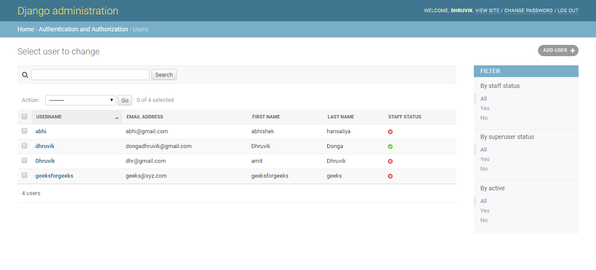
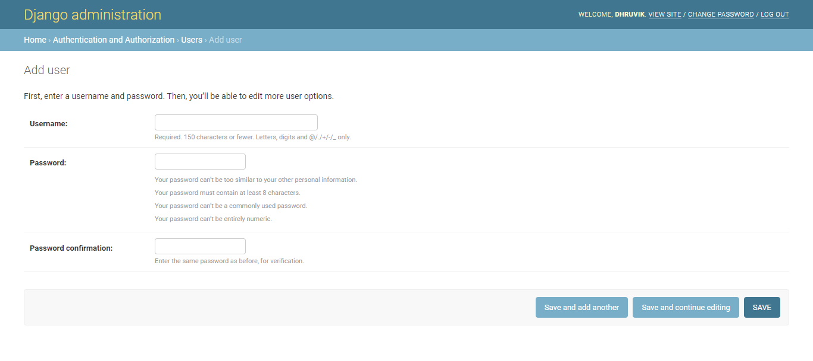
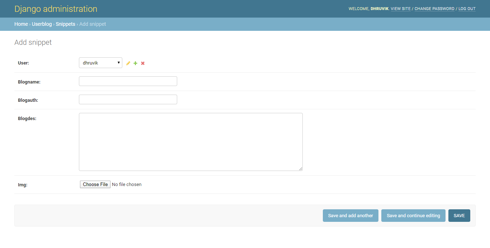

# Django user defined post

This project will help us to understand how to link the upload to a user and can be used to create user related activites

## Getting Started

These instructions will get you install and deploy project in your system .

### Prerequisites

What things you need to install the software and how to install them

```
Python
Django
PostgreSQL
```

### Installing

A step by step series of examples that tell you how to get a development env running

Make a directory of project
```
mkdir stream
cd stream
```
start project
```
django-admin startproject stream
cd stream
```
You will get some important files you need to work on that is settings.py and urls.py

Now simply replace those both files by the files that are in repo

Start the application accounts and replace the urls.py and views.py in accounts with the files in repo
```
python manage.py startapp accounts
python manage.py migrate
python manage.py makemigrations

```

if required then
```
pip install pillow
```

Perform same steps for application userblog


### Check the django admin panel if you have used it or else reset the password of the panel and create a superuser

### Prefer to django documentation for more information

## User panel


## Blog panel

